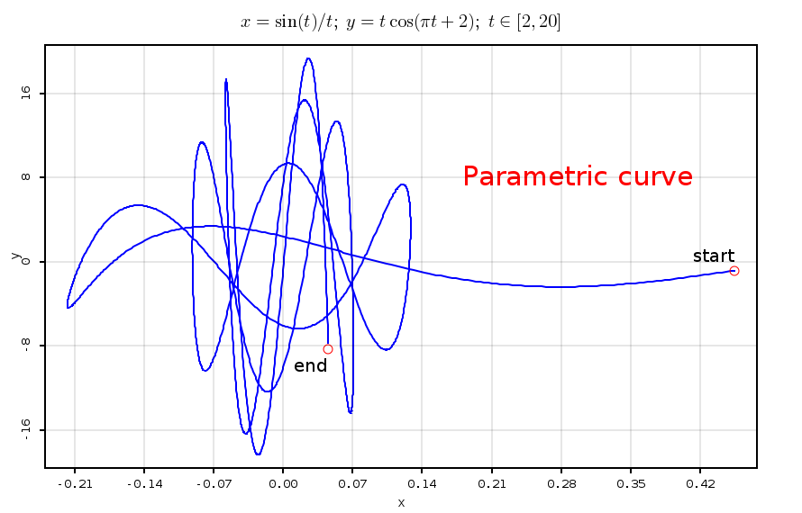

 Scala 2D Plotting library.
===========================
[](https://travis-ci.com/priimak/splot)
[](http://codecov.io/github/priimak/splot/coverage.svg?branch=master)
[](https://raw.githubusercontent.com/priimak/splot/master/LICENSE)

_Version: 0.6.0-SNAPSHOT_

Documentation for latest release version (0.5.0) is available at [splot-web.github.io](https://splot-web.github.io/).

_SPlot_ is a poor-man replacement of [matplotlib](https://matplotlib.org/) Python library for Scala.

Current version of this library is available on maven central at these coordinates

```bash
libraryDependencies += "xyz.devfortress.splot" % "splot-core_2.13" % "0.5.0"
```

It can plot line plots, scatter plots, arbitrary closed polygons, heatmap plots etc.

To try it out type or cut-and-paste following into your [Ammonite-REPL](https://ammonite.io/#Ammonite-REPL)

```scala
import $ivy.`xyz.devfortress.splot::splot-core:0.5.0`, xyz.devfortress.splot._

import math.mkSeq
import java.awt.Color
import java.lang.Math.{PI, cos, sin}

def x(t: Double): Double = sin(t) / t
def y(t: Double): Double = cos(PI * t + 2) * t
val fig = Figure(
  title = """$x = \sin(t)/t;\;y = t\cos(\pi t + 2);\;t\in[2, 20]$""",
  xLabel = "x",
  yLabel = "y",
  showGrid = true
)

val xy = mkSeq(2, 20, 0.01).map(t => (sin(t)/t, cos(PI * t + 2) * t ))
fig.plot(xy, color = "blue", lw = 2)
fig.add(Label("Parametric curve", 0.18, 7.3, fontSize = 30, color = Color.RED))
fig.scatter(Seq((x(2), y(2))), pt = "o", ps = 10, color = "red")
fig.scatter(Seq((x(20), y(20))), pt = "o", ps = 10, color = "red")
fig.add(Label("start", x = x(2), y = y(2) + 0.8, anchor = Anchor.RIGHT_LOWER, fontSize = 20))
fig.add(Label("end", x = x(20), y = y(20) - 0.5, anchor = Anchor.RIGHT_UPPER, fontSize = 20))
fig.show(900, 600)
```

You should see a window popup with following figure.

