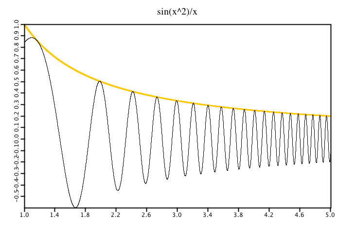
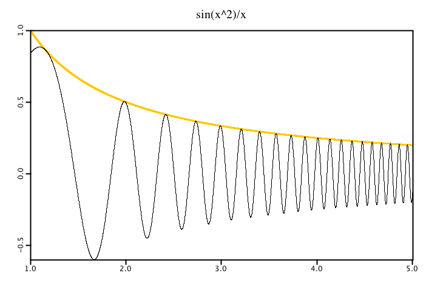
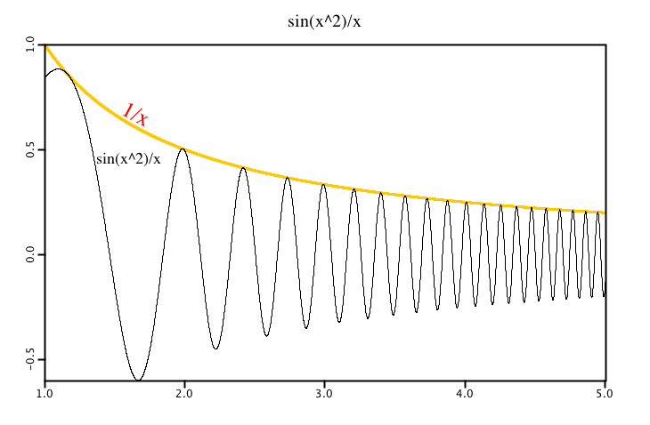

title:      Simple Line Plot
date:       2018/12/08
template:   document
nav:        Examples __1__ >Simple Line Plot __1__
percent:    100

Lets draw a function `f(x) = sin(x^2)/x` on the domain `[1,5]`.
```scala
import java.lang.Math.{pow, sin}

import xyz.devfortress.splot._

object SimpleLinePlotExample {
  def f(x: Double) = sin(pow(x, 3)) / x

  def main(args: Array[String]): Unit = {
    val fig = Figure(title = "sin(x^2)/x")
    val xs = 1.0 to 5.0 by 0.001

    # draw envelope function
    fig.plot(xs.map(x => (x, 1/x)), color = "orange", lw = 2)

    fig.plot(xs.map(x => (x, f(x))))
    fig.show(730, 500)
  }
}
```


Function that defined ticks did not do particularly good job and that.
In particular ticks on the y-axis are way too close. Lets redefine them
like so

```scala
val fig = Figure(
  title = "sin(x^3)/x",
  xTicks = Ticks(1,2,3,4,5),
  yTicks = Ticks(-0.5, 0, 0.5, 1)
)
```


SPlot currently does not create automatic legends but we can add labels.

```scala
fig.add(Label("sin(x^2)/x", 1.37, f(1.36), font = Font.decode("Times-18")))
fig.add(Label(
  "1/x", 1.54, 1/1.5,
  font = Font.decode("Serif-25").deriveFont(AffineTransform.getRotateInstance(0.49)),
  color = Color.RED
))
```


