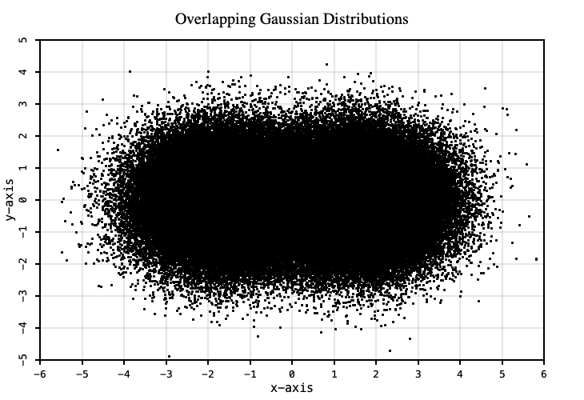
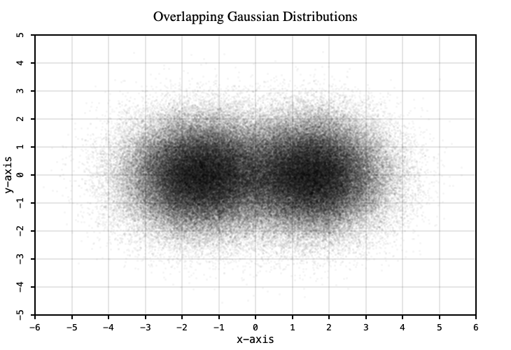

# Scatter Plot

Lets plot two overlapping gaussian 2-dimensional distributions centered at
`(-1.5, 0)` and `(1.5, 0)` using 200,000 data points.

```scala
import java.awt.Color
import java.util.Random

import xyz.devfortress.splot._

def main(args: Array[String]): Unit = {
  val fig = new Figure(
    xTicks = Ticks(-6 to 6), yTicks = Ticks(-5 to 5),
    domain = (-6, 6), range = (-5, 5),
    title = "Overlapping Gaussian Distributions",
    showGrid = true
  )

  val rnd = new Random()
  val gs = (0 to 100000).map(_ => (rnd.nextGaussian() - 1.5, rnd.nextGaussian())) ++
    (0 to 100000).map(_ => (rnd.nextGaussian() + 1.5, rnd.nextGaussian()))

  fig.scatter(gs, pt = "o")
  fig.show(730, 500)
}
```



Due to the high density of points at the centers of distributions internal structure
is not really visible. You cannot see that there are too peaks in there. Common solution
to this problem is to plot points of the distribution semi-transparent. Since
color density of semi-transparent objects is additive, but adjusting value of alpha channel
and point size we can make dense scatter plot to reveal its internal structure. We can do
that like so:

```scala
// Alpha channel is set to 10. Fully opaque (default) value is 255.
fig.scatter(gs, pt = "o", color = new Color(0, 0, 0, 10))
```


