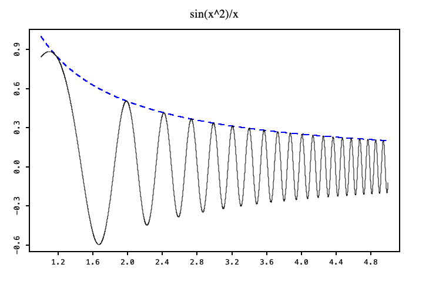
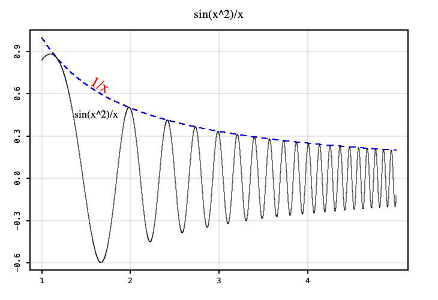

# Simple Line Plot

Lets draw a function `f(x) = sin(x^2)/x` on the domain `[1,5]`.
```scala
import java.lang.Math.{pow, sin}

import xyz.devfortress.splot._

object SimpleLinePlotExample {
  def f(x: Double): Double = sin(pow(x, 3)) / x

  def main(args: Array[String]): Unit = {
    val fig = Figure(
      title = "sin(x^2)/x",
    )
    val xs = 1.0 to 5.0 by 0.001

    fig.plot(xs.map(x => (x, 1/x)), color = "blue", lw = 2, lt = "--")
    fig.plot(xs.map(x => (x, f(x))))
    fig.show(730, 500)
  }
}
```


Notice that domain and range of the plot was automatically derived and some
padding was added on both axis. Position of ticks was also automatically
derived but we may want to set them explicitly. Let say we want to set them
on the x-axis at points 1, 2, 3 and 4 and also show grid associated with
them. We can do that like so:

```scala
val fig = Figure(
  title = "sin(x^2)/x",
  showGrid = true,
  xTicks = Ticks(1 to 4),
)
```


SPlot currently does not create automatic legends but we can add labels.

```scala
fig.add(Label("sin(x^2)/x", 1.37, f(1.36), font = Font.decode("Times-18")))
fig.add(Label(
  "1/x", 1.54, 1/1.5,
  font = Font.decode("Serif-25").deriveFont(AffineTransform.getRotateInstance(0.5)),
  color = Color.RED
))
```


